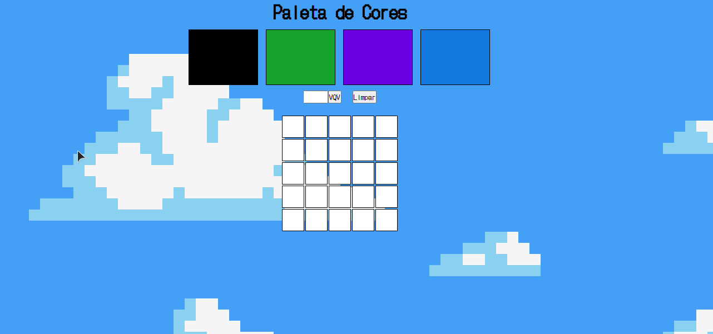

<h1 align="center">
    
</h1>

## **SOBRE**
Projeto criado dentro do módulo de Fundamentos na **Trybe**.

O objetivo principal do projeto era implementar uma página web que contém uma paleta de cores funcional que poderá ser utilizada para criar desenhos em pixels.

Como bônus também foi implementada a opção de gerar cores aleatórias todas as vezes em que a página era atualizada.

### **Habilidades**
- Manipular o DOM

- Manipular o Javascript

### **TÉCNOLOGIAS UTILIZADAS**
- HTML
- CSS
- JavaScript

